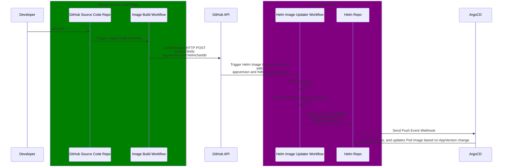

# Helm Image Updater

This action promotes a Helm Charts AppVersion based on external webhook/http-request.

*This Action alone will not trigger a version update, you will need a GitHub pipeline or thereabouts*

## How does it work?

The Workflow will trigger on a [external request](#how-to-trigger-example-request), and overwrite the **appVersion** value in Chart.yaml based on appVersion from the request body.




## Prerequisites

### **Helm Chart**
To insure a single source of truth to the image version, your Helm template for deployment/pod needs to have **appVersion** from Chart.yaml implemented.

Chart.yaml example:
```yaml
apiVersion: v2
name: awesomechart
appVersion: 1.3.8 #this can be semver, digest, tag etc.
version: 1.2.1
```

Deployment Template Example:
```yaml
containers:
  - name: example-container
    image: registry.azurecr.io/platform-tools/go-httpbin:{{.Chart.AppVersion}}
```

---

## Example usage in Chart repo:

```yaml
on:
  repository_dispatch:
    types: [bump_appversion]
jobs:
  helm_appversion_bumper:
    runs-on: ubuntu-latest
    name: Helm Chart Bump AppVersion
    permissions:
      # Give the default GITHUB_TOKEN write permission to commit and push the
      # added or changed files to the repository.
      contents: write
    steps:
      # To use this repository's private action,
      # you must check out the repository
      - name: Checkout
        uses: actions/checkout@v3
      - name: Helm Chart Bump AppVersion
        uses: ./ # Uses an action in the root directory
        id: appversionbump
        with:
          appversion: ${{ github.event.client_payload.appversion }}
          helmchartdir: ${{ github.event.client_payload.helmchartdir }}
      # Use the output from the `appversionbump` step
      - name: Output
        run: echo "${{ steps.appversionbump.outputs.result }}"
      - uses: stefanzweifel/git-auto-commit-action@v4
```

## Github Workflow trigger example (from the image build pipeline):

### Simple Curl workflow step:
```yaml
steps:
- name: Bump AppVersion
  env:
    GitRepo: MortyN/helm-repo
    ChartLocation: charts/piclustermetrics/Chart.yaml
    AppVersion: ${{ github.sha }}
  run: |
    curl -L \
    -X POST \
    -H "Accept: application/vnd.github+json" \
    -H "Authorization: ${{ secrets.ACTIONS_PAT_KEY }}" \
    -H "X-GitHub-Api-Version: 2022-11-28" \
    https://api.github.com/repos/${{ env.GitRepo }}/dispatches \
    -d '{"event_type":"bump_appversion","client_payload":{"appversion": "${{ env.AppVersion }}", "helmchartdir": "${{ env.ChartLocation }}"}}'
```

### Self-contained GitHub action trigger:

```yaml
steps:
- name: Helm Chart Bump AppVersion
  uses: MortyN/helm-image-updater-trigger-action@v1.4
  id: triggerappversionbump
  with:
    git-repo: MortyN/helm-repo
    chart-location: charts/piclustermetrics/Chart.yaml
    appversion: ${{ env.IMAGEVERSION }}
    actions-pat-key: ${{ secrets.ACTIONS_PAT_KEY }}
```

Docs about this endpoint: https://docs.github.com/en/rest/repos/repos?apiVersion=2022-11-28#create-a-repository-dispatch-event

## Contributing

Please read [Creating a JavaScript action](https://docs.github.com/en/actions/creating-actions/creating-a-javascript-action) to understand the core principles.

### Dependencies

```sh
#GitHub Action Deps
npm install @actions/core
npm install @actions/github
#Vercel, for packaging action
npm i -g @vercel/ncc
```

### Useful docs

 - [Rate limits, Resources in the REST API \(GitHub REST API\)](https://docs.github.com/en/rest/overview/resources-in-the-rest-api?apiVersion=2022-11-28#rate-limits)
 - [Create a repository dispatch event, Repositories \(GitHub REST API\)](https://docs.github.com/en/rest/repos/repos?apiVersion=2022-11-28#create-a-repository-dispatch-event)
